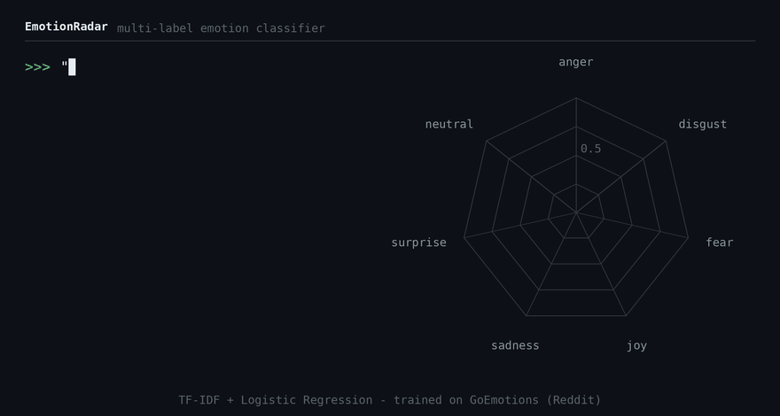
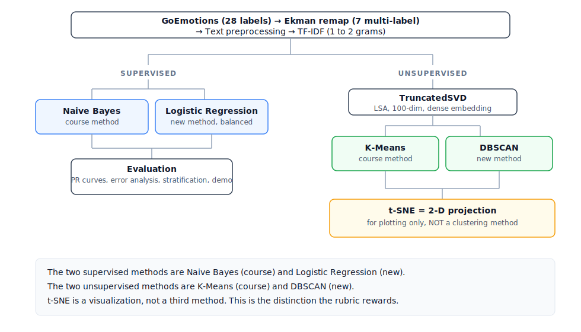
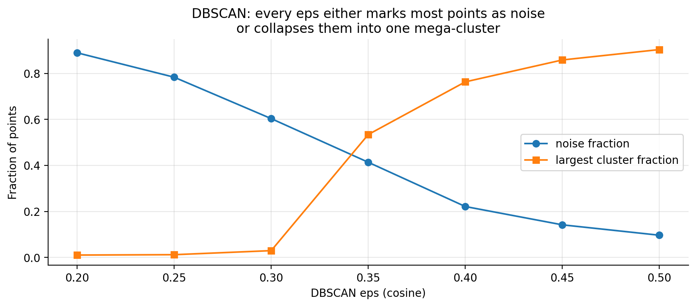
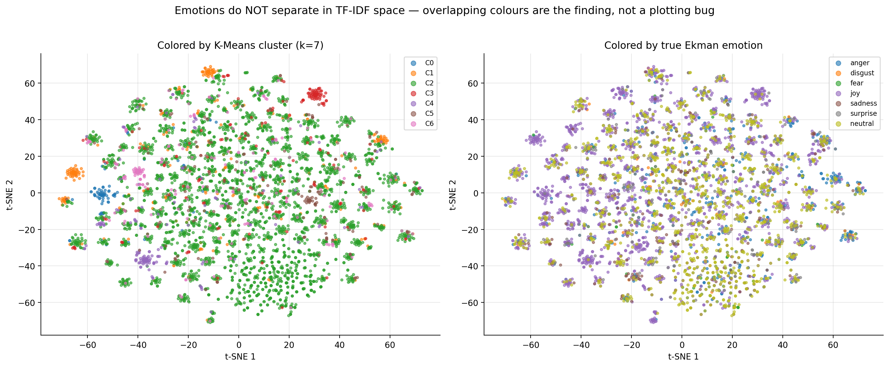

# Emotion Radar: Multi-Label Emotion Classification


[-4285F4?logo=google&logoColor=white)](https://huggingface.co/datasets/google-research-datasets/go_emotions)
[](https://colab.research.google.com/github/fammad/EmotionRadar/blob/main/EmotionRadar_Report.ipynb)



> **Run this yourself.** [](https://colab.research.google.com/github/fammad/EmotionRadar/blob/main/EmotionRadar_Report.ipynb)
> One click, no install. The notebook downloads the data, trains both models, and reproduces every number and figure in this README. Change `INPUT_TEXT` in Section 6 to test your own sentences.

Emotion Radar tags short text with any of the seven Ekman emotions at once (multi-label, so a comment can be angry and relieved at the same time) and shows which words pushed each prediction. We built it for reading user-generated text at scale, where you want the evidence, not just the label.

The model is a class-balanced one-vs-rest logistic regression over TF-IDF, trained on ~58k Reddit comments from GoEmotions. It doubles the Naive Bayes baseline's macro-F1 (0.25 to 0.51), and every prediction traces back to actual words. The repo also holds a negative result. Emotions don't cluster in TF-IDF space, and we show that three different ways.

```
"I'm furious but also kind of relieved it's over."
   -> anger  (driven by: furious)
   -> joy    (driven by: relieved)
```

---

## Overview

The project answers two questions, in order:

1. **Unsupervised:** do emotional comments cluster by emotion before any labels get involved? We tested with K-Means and DBSCAN on a TF-IDF/LSA representation. They don't, and we treat that as a finding worth defending, not a number to fix.
2. **Supervised:** with labels, how well can the seven emotions actually be predicted? Naive Bayes as the baseline, class-balanced logistic regression as the contender, judged per emotion instead of one aggregate score.

The dataset is [GoEmotions](https://github.com/google-research/google-research/tree/master/goemotions) (Demszky et al., 2020), ~58k Reddit comments. Its 28 fine-grained labels are remapped to the 7 [Ekman basic emotions](https://en.wikipedia.org/wiki/Emotion_classification#Basic_emotions) (anger, disgust, fear, joy, sadness, surprise, neutral) for more samples per class and cleaner interpretation.



---

## Headline results

| | Naive Bayes (baseline) | Logistic Regression (balanced) |
|---|:---:|:---:|
| Macro-F1 | 0.25 | **0.51** |
| Micro-F1 | 0.44 | **0.58** |
| Macro ROC-AUC | 0.75 | **0.84** |

Logistic regression roughly doubles the macro-F1 of the baseline. The gain comes almost entirely from `class_weight="balanced"`, which forces the model to take the rare emotions (disgust and fear, ~100 training examples each) seriously instead of ignoring them.

Performance is uneven by design rather than by accident. **Joy** is detected reliably (F1 ≈ 0.75) because it has thousands of examples and a distinctive vocabulary. **Fear** scores surprisingly well (F1 ≈ 0.53) on only 98 samples, because its vocabulary ("scared", "nervous", "afraid") is narrow and consistent. The vaguer, rarer classes lag, and the report explains each case rather than averaging it away.

---

## The unsupervised finding

Three independent checks agree that emotions do **not** form natural groups in TF-IDF space.

**DBSCAN eps sweep.** There is no setting that produces several balanced clusters. Small `eps` labels nearly everything as noise; large `eps` collapses everything into one blob. The two lines cross with no healthy middle ground.



**t-SNE projection.** Coloured by true emotion (right panel), the points are a uniform mix with no separated regions. This is the visual confirmation of the same result.



Alongside these, K-Means at k=7 gives a silhouette of ≈ 0.05 with ARI ≈ 0 and NMI ≈ 0.05, and one cluster absorbs most of the data. A 300-dimension control rules out aggressive dimensionality reduction as the cause, since tripling the retained variance barely moves the silhouette.

The conclusion is that the limitation lives in the *representation*. Bag-of-words TF-IDF encodes which words appear, not what they mean, so two angry comments with no shared vocabulary sit as far apart as an angry one and a happy one. It would be easy to mistake this result for a bug. The project's contribution is showing, with evidence, that it is a real property of the feature space.

---

## Why TF-IDF and not embeddings

Sentence embeddings (e.g. Sentence-BERT) would almost certainly cluster better and score higher. We picked TF-IDF anyway, because its features *are individual words*. Each logistic regression coefficient maps straight back to a word in the vocabulary, and that is what makes the attribution in the demo possible. We knowingly traded raw performance for interpretability, and the report treats it as a trade, not a footnote. The embedding version is the obvious next step, listed under future work.

---

## More figures

The notebook produces the full set of evaluation plots (label distribution, K-Means model selection, per-emotion F1, confusion matrices, F1 by text length, error patterns, and top contributing words per emotion). Running it regenerates them all in `assets/figures/`.

---

## Repository structure

```
EmotionRadar/
├── EmotionRadar_Report.ipynb   # main deliverable: report + collapsible code
├── data/
│   ├── processed/         # train.csv, val.csv, test.csv (Ekman-remapped)
│   └── models/            # nb_model.pkl, lr_model.pkl, tfidf.pkl
├── assets/
│   ├── emotionradar_demo.gif
│   └── figures/           # generated plots
├── requirements.txt
└── README.md
```

The notebook is written to read **top to bottom as a report**, with code collapsed by default and expandable for inspection.

---

## Running it

The fastest way is [Colab](https://colab.research.google.com/github/fammad/EmotionRadar/blob/main/EmotionRadar_Report.ipynb). Open the notebook, run all cells, and it downloads GoEmotions and reproduces everything from scratch. Nothing to install.

To run it locally instead:

```bash
git clone https://github.com/fammad/EmotionRadar.git
cd EmotionRadar
pip install -r requirements.txt
jupyter lab EmotionRadar_Report.ipynb
```

Then run all cells. On first run, if `data/processed/` is empty, the notebook downloads GoEmotions from HuggingFace and rebuilds the splits automatically; afterwards it loads the cached CSVs. Running the notebook regenerates every figure in `assets/figures/`.

**Core dependencies:** `scikit-learn`, `nltk`, `numpy`, `pandas`, `matplotlib`, `seaborn`, `datasets`.

---

## Method summary

| Stage | Choice | Notes |
|---|---|---|
| Labels | 28 -> 7 Ekman emotions | multi-label; a comment can carry several |
| Features | TF-IDF, 1-2 grams, 5k vocab | fit on train only, no leakage |
| Reduction | TruncatedSVD (LSA) to 100 dims | 300-dim version kept as a control |
| Unsupervised | K-Means + DBSCAN | two independent algorithms; t-SNE for visualization only |
| Supervised | MultinomialNB baseline + LogReg (balanced) | `OneVsRest`, tuned on validation |
| Evaluation | macro/micro-F1, ROC-AUC, per-emotion confusion, length stratification, error analysis | macro-F1 as the headline metric |

t-SNE only projects the embeddings to 2-D for plotting. It is not a clustering method and feeds nothing downstream.

---

## Reproducibility

- A single fixed seed (`RANDOM_STATE = 42`) governs every stochastic step, from the split through K-Means initialisation, t-SNE, and sampling.
- The TF-IDF vectoriser is fit on training data only; validation and test reuse the same vocabulary.
- Trained models and the fitted vectoriser are saved to `data/models/` so results can be reloaded without retraining.

---

## Future work

- Per-emotion decision thresholds tuned on validation, instead of a shared 0.5.
- A Sentence-BERT pipeline to measure exactly how much clustering and accuracy improve once interpretability is traded away.
- A fine-tuned DistilBERT baseline, to see how far a context-aware model closes the gap on sarcasm and negation, the two failure modes TF-IDF cannot handle.

---

## Issues & improvements

If something doesn't run, or you see a better way to do any part of this, [open an issue](https://github.com/fammad/EmotionRadar/issues). The future-work list is a starting point, not a boundary. And if you think trading accuracy for interpretability was the wrong call, open an issue for that too.

---

## References

- Demszky, D., Movshovitz-Attias, D., Ko, J., Cowen, A., Nemade, G., & Ravi, S. (2020). *GoEmotions: A Dataset of Fine-Grained Emotions.* ACL 2020.
- Ekman, P. (1992). *An Argument for Basic Emotions.* Cognition & Emotion, 6(3-4), 169-200.
- Géron, A. *Hands-On Machine Learning with Scikit-Learn and PyTorch.* O'Reilly.
- scikit-learn documentation: multiclass/multilabel classification, clustering, and TruncatedSVD.

---

## Status

Submitted as the final project for DM1590 (Machine Learning for Media Technology) at KTH, May 2025, and graded **A** on a rubric covering supervised application, unsupervised application, evaluation, and presentation.

## Team

Group 15, DM1590, KTH Royal Institute of Technology: Fuad Mammadov, Qingya Li, Xinyutong Zhang, Jintong Jiang.

## Credits & contact

Licensed under MIT. If you build on this or reuse parts of it, a credit or link back is appreciated but not required.

**Fuad Mammadov**
[fammad.com](https://fammad.com/work/emotionradar) · [LinkedIn](https://www.linkedin.com/in/fammad/)